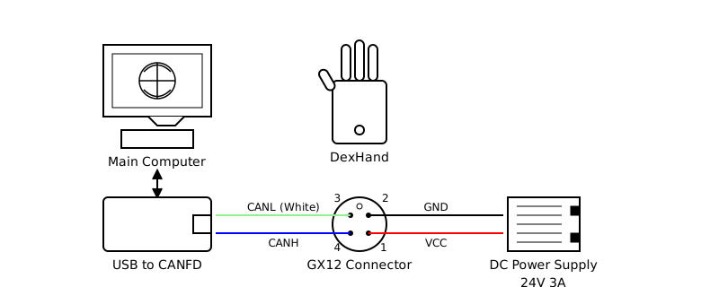

[English](README.md) | [中文](README_zh.md)

# DexHand Python 接口

用于通过 ZLG USBCANFD 适配器控制灵巧机器人手的 Python 接口。提供直接控制和 ROS2 集成功能。

## 概述

本软件包提供：

- 用于 DexHand 硬件的 CANFD 通信接口
- 带有反馈处理的关节空间控制接口
- 内置数据记录和可视化工具
- ROS2 接口实现
- 硬件测试工具

## 环境要求

- Linux 环境
- Python 3.8+
- ZLG USBCANFD 适配器（已在 USBCANFD-200U 上测试）
- ROS1/ROS2（可选，用于 ROS 接口）

## 硬件设置

请参考以下连接示意图：



## 安装

1. 下载或克隆仓库：

   ```bash
   git clone https://gitee.com/DexRobot/pyzlg_dexhand.git
   ```

2. 安装软件包：

   ```bash
   pip install -e .
   ```

3. 配置 USB 权限：

   ```bash
   sudo ./tools/setup_usb_can.sh
   ```

   设置脚本将：

   - 创建 canbus 用户组
   - 将你的用户添加到该组
   - 设置 USBCANFD 适配器的 udev 规则
   - 配置适当的权限

   **你可能需要注销并重新登录才能使更改生效。**

4. 编辑 `config/config.yaml` 以匹配你的硬件设置，特别是**通道和 ZCAN 设备类型**。

## 使用示例

### 1. 硬件测试

运行硬件测试：

```bash
python tools/hardware_test/test_dexhand.py --hands right
```

这将使机器人手执行一系列预定义的动作。

### 2. 交互式测试

启动交互式控制界面：

```bash
python tools/hardware_test/test_dexhand_interactive.py --hands right
```

这将提供一个加载了机器人手对象和辅助函数的 IPython shell。

示例命令：

```python
right_hand.move_joints(th_rot=30)  # 旋转拇指
right_hand.move_joints(ff_mcp=60, ff_dip=60)  # 弯曲食指
right_hand.move_joints(ff_spr=20, control_mode=ControlMode.PROTECT_HALL_POSITION)  # 展开所有手指，使用替代控制模式
right_hand.get_feedback()
right_hand.reset_joints()
right_hand.clear_errors()    # 清除所有错误状态
```

你可以使用 tab 键补全和帮助命令来探索 API。

### 3. ROS 集成

本 SDK 提供支持 ROS1（rospy）和 ROS2（rclpy）环境的 ROS 接口，可自动检测并使用适当的框架。

使用方法：

```bash
# 使用默认配置启动 ROS 节点
python examples/ros_node/dexhand_ros.py

# 运行演示发布程序（用于测试）
python examples/ros_node/dexhand_ros_publisher_demo.py --hands right --cycle-time 3.0
```

接口：

| 话题（默认）        | 类型                     | 方向 | 描述                       |
| ------------------- | ------------------------ | ---- | -------------------------- |
| `/joint_commands`   | `sensor_msgs/JointState` | 输入 | 关节位置命令               |
| `/joint_states`     | `sensor_msgs/JointState` | 输出 | 关节位置反馈（即将推出）   |
| `/tactile_feedback` | TBD                      | 输出 | 触觉传感器数据（即将推出） |

话题名称可通过 `config/config.yaml` 配置。

| 服务           | 类型               | 描述               |
| -------------- | ------------------ | ------------------ |
| `/reset_hands` | `std_srvs/Trigger` | 将手重置至默认位置 |

注意：

- 命令中的关节名称与 URDF 文件规范匹配
- 配置可通过 `config/config.yaml` 自定义
- 所有功能在 ROS1 和 ROS2 环境中均相同

### 4. 编程接口

示例代码：

```python
from pyzlg_dexhand import LeftDexHand, RightDexHand, ControlMode

# 初始化机器人手
hand = RightDexHand()
hand.init()

# 移动拇指
hand.move_joints(
    th_rot=30,  # 拇指旋转（0-150度）
    th_mcp=45,  # 拇指掌指关节弯曲（0-90度）
    th_dip=45,  # 拇指远端关节弯曲
    control_mode=ControlMode.CASCADED_PID
)

# 获取反馈
feedback = hand.get_feedback()
print(f"拇指角度: {feedback.joints['th_rot'].angle}")
print(f"触觉力: {feedback.tactile['th'].normal_force}")
```

注意：

- 控制模式

  - `CASCADED_PID`：提供更高刚度的精确位置控制
  - `PROTECT_HALL_POSITION`：提供更平滑的响应，但要求关节在上电时处于零位

- 错误处理

  - 当手指运动被物体阻挡时，可能会进入错误状态并对控制信号无响应。为了可靠的持续控制，应在发送每个命令后调用 `hand.clear_errors()`

## 架构

### 核心组件

#### 1. ZCAN 层 (zcan.py)

- 原始 CANFD 帧处理
- 硬件初始化
- 错误处理
- 消息过滤

#### 2. 协议层 (dexhand_protocol/)

- 命令编码/解码
- 消息解析
- 错误检测
- 反馈处理

#### 3. 接口层 (dexhand_interface.py)

- 高级控制 API
- 关节空间映射
- 反馈处理
- 错误恢复

### 应用程序

软件包包含使用核心接口构建的示例应用：

- ROS2 接口 (examples/ros2_demo/)
- 硬件测试工具 (tools/hardware_test/)
- 交互式测试 shell

## 数据记录

用于分析和调试的内置日志功能：

```python
from pyzlg_dexhand import DexHandLogger

# 初始化记录器
logger = DexHandLogger()

# 记录命令和反馈
logger.log_command(command_type, joint_commands, control_mode, hand)
logger.log_feedback(feedback_data, hand)

# 生成分析
logger.plot_session(show=True, save=True)
```

日志包括：

- 关节命令和反馈
- 触觉传感器数据
- 错误状态
- 时序信息

## 配置

`config/` 中的配置文件：

- `config.yaml`：左/右手参数、ROS2 节点设置和 ZCAN 配置

## 贡献

1. Fork 仓库
2. 创建功能分支（`git checkout -b feature/improvement`）
3. 遵循现有的代码结构和文档规范
4. 添加适当的错误处理和日志记录
5. 根据需要更新测试
6. 提交拉取请求

## 许可证

本项目采用 Apache License 2.0 许可证 - 详见 LICENSE 文件。

注意：本软件按原样提供。虽然我们努力保持与 DexHand 产品的兼容性，但使用本软件需自担风险。
