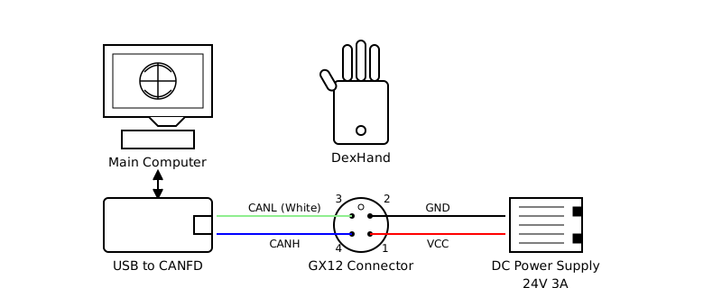

Quickstart Guide
==============

This guide will help you get started with the DexHand Python Interface.

Overview
--------

The DexHand Python Interface provides:

* CANFD communication interface for DexHand hardware
* Joint-space control interface with feedback processing
* Built-in data logging and visualization tools
* ROS2 interface implementation
* Hardware testing utilities

Prerequisites
------------

* Linux environment
* Python 3.8+
* ZLG USBCANFD adapter (tested with USBCANFD-200U)
* ROS1/ROS2 (optional, for ROS interface)

Hardware Setup
-------------

Please refer to the hardware connection diagram:

Installation
-----------

1. Install the package::

    pip install -e .

2. Configure USB permissions::

    sudo ./tools/setup_usb_can.sh

The setup script will:

* Create a canbus group
* Add your user to the group
* Set up udev rules for the USBCANFD adapter
* Configure appropriate permissions

You may need to log out and back in for the changes to take effect.

3. Edit ``config/config.yaml`` to match your hardware setup, especially channels and ZCAN device type.

Usage Examples
------------

1. Hardware Testing
^^^^^^^^^^^^^^^^^

Run hardware tests to verify your setup::

    python tools/hardware_test/test_dexhand.py --hands right

This should move the hand through a series of predefined motions.

2. Interactive Control
^^^^^^^^^^^^^^^^^^

CLI Option
"""""""""

Launch interactive control interface::

    python tools/hardware_test/test_dexhand_interactive.py --hands right

This provides an IPython shell with initialized hand objects and helper functions.

Example commands::

    right_hand.move_joints(th_rot=30)  # Rotate thumb
    right_hand.move_joints(ff_mcp=60, ff_dip=60)  # Curl index finger
    right_hand.move_joints(ff_spr=20, control_mode=ControlMode.PROTECT_HALL_POSITION)  # Spread all fingers, with alternative control mode
    right_hand.get_feedback()
    right_hand.reset_joints()
    right_hand.clear_errors()    # Clear all error states

You can explore the API with tab completion and help commands.

GUI Option
"""""""""

Firstly, install the ``PyQt6`` dependency::

    pip install PyQt6    # Install other dependencies, via e.g., apt, if prompted

Then, run the GUI interface::

    python examples/dexhand_gui.py

The GUI provides real-time joint angle control via sliders.

3. ROS Integration
^^^^^^^^^^^^^^^

The SDK provides a ROS interface supporting both ROS1 (rospy) and ROS2 (rclpy) environments.

Start the ROS node::

    # Launch node with default configuration
    python examples/ros_node/dexhand_ros.py

    # Run the demo publisher
    python examples/ros_node/dexhand_ros_publisher_demo.py --hands right --cycle-time 3.0

Interface
""""""""

**Topics:**

+-------------------+---------------------------+----------+--------------------------------+
| Topic (default)   | Type                      | Direction| Description                    |
+===================+===========================+==========+================================+
| /joint_commands   | sensor_msgs/JointState    | Input    | Joint position commands        |
+-------------------+---------------------------+----------+--------------------------------+
| /joint_states     | sensor_msgs/JointState    | Output   | Joint position feedback        |
+-------------------+---------------------------+----------+--------------------------------+
| /tactile_feedback | TBD                       | Output   | Tactile sensor data           |
+-------------------+---------------------------+----------+--------------------------------+

**Services:**

+-------------+------------------+--------------------------------+
| Service     | Type             | Description                    |
+=============+==================+================================+
| /reset_hands| std_srvs/Trigger | Reset hands to default position|
+-------------+------------------+--------------------------------+

Notes:

* Joint names in commands match the URDF file specifications
* Configuration can be customized through ``config/config.yaml``
* All features work identically in both ROS1 and ROS2 environments

4. Programming Interface
^^^^^^^^^^^^^^^^^^^^

Example code:

.. code-block:: python

    from pyzlg_dexhand import LeftDexHand, RightDexHand, ControlMode

    # Initialize hand
    hand = RightDexHand()
    hand.init()

    # Move thumb
    hand.move_joints(
        th_rot=30,  # Thumb rotation (0-150 degrees)
        th_mcp=45,  # Thumb MCP flexion (0-90 degrees)
        th_dip=45,  # Thumb coupled distal flexion
        control_mode=ControlMode.CASCADED_PID
    )

    # Get feedback
    feedback = hand.get_feedback()
    print(f"Thumb angle: {feedback.joints['th_rot'].angle}")
    print(f"Tactile force: {feedback.tactile['th'].normal_force}")

Control Modes
^^^^^^^^^^^

* ``CASCADED_PID``: Provides precise position control with higher stiffness
* ``PROTECT_HALL_POSITION``: Offers smoother response but requires joints to be in zero position at power-on

Error Handling
^^^^^^^^^^^^

When a finger's motion is obstructed by an object, it may enter an error state and become unresponsive to control signals. For reliable continuous control, call ``hand.clear_errors()`` after sending each command.

Data Logging
----------

Built-in logging for analysis and debugging:

.. code-block:: python

    from pyzlg_dexhand import DexHandLogger

    # Initialize logger
    logger = DexHandLogger()

    # Log commands and feedback
    logger.log_command(command_type, joint_commands, control_mode, hand)
    logger.log_feedback(feedback_data, hand)

    # Generate analysis
    logger.plot_session(show=True, save=True)

Logs include:

* Joint commands and feedback
* Tactile sensor data
* Error states
* Timing information

Next Steps
---------

* Review the API documentation for detailed interface information
* Check out the examples directory for more usage examples
* See the hardware test scripts for automated testing approaches
